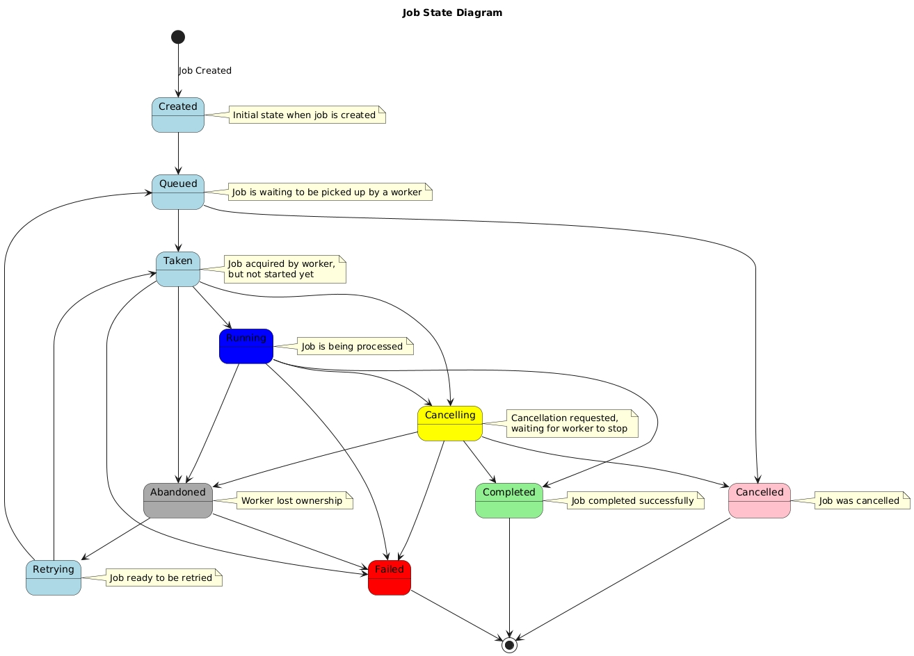

# long-running-job-simulation
Simulates a hard processing task for input data items provided by the user.

### About the project
This is a .NET application that simulating long-running back-end tasks. It consists of API and Background Services. API allows to create/cancel tasks, check their state and subscribe to the specific one. Background Services are responsible for task execution and retry/cleanup. Since task state is periodically saving to the database with appropriate status, the system is fault-tolerant and horizontally scalable.
Task is represented by a Job entity. The diagram below demonstrates all possible states and transitions between them:



Currently supported Job types: 
- [InputEncodeJob](src/LongJobProcessor.Application/Workers/InputEncodeJobExecutor.cs)

The system is ready for extension with new job types.

Front-end side that integrates this API:
[long-running-job-client](https://github.com/DmitryTolkachev1/long-running-job-client)

### Built with

- [.NET 10](https://dotnet.microsoft.com/en-us/download/dotnet/10.0)  
- [Server-Sent Events (SSE)](https://developer.mozilla.org/en-US/docs/Web/API/Server-sent_events)
- [Entity Framework Core](https://learn.microsoft.com/en-us/ef/core/)   
- [Moq](https://github.com/moq/moq4)  
- [xUnit](https://xunit.net/)  
- [FluentAssertions](https://fluentassertions.com/)  
- [Docker](https://www.docker.com/)  
- [PostgreSQL](https://www.postgresql.org/)  
- [Neon DB](https://neon.com/)

## Getting started

### Prerequisites

- [.NET 10 SDK](https://dotnet.microsoft.com/en-us/download/dotnet/10.0)  
- [PostgreSQL](https://www.postgresql.org/)  
- [Git](https://git-scm.com/)  
- IDE: [Visual Studio 2026](https://visualstudio.microsoft.com/) or [VS Code](https://code.visualstudio.com/) + [.NET CLI](https://learn.microsoft.com/en-us/dotnet/core/tools/)  

### Installation

1. **Clone** the repository:  
   ```bash
   git clone https://github.com/DmitryTolkachev1/long-running-job-simulation.git
   cd long-running-job-simulation
2. **Checkout** the `master` branch:
   ```bash
   git switch master
3. **Configure** your connection string in `appsettings.json` or `launchSettings.json`.
4. **Apply** migrations:
    ```bash
    Update-Database
5. **Build & run** the solution.

### Local run using Docker/Podman

1. **Open Dockerfile** and configure environment variables:
    ```docker
    # default values
    ENV USERNAME="user"
    ENV PASSWORD="password"
    ENV DefaultConnection="your-postgre-connection-string"
2. **Build image**:
    - For Docker:
    ```bash
    cd long-running-job-simulation
    docker build -t job-service:latest -f src\LongJobProcessor.API\Dockerfile .
    ```
    - For Podman:
    ```bash
    cd long-running-job-simulation
    podman build -t job-service:latest -f src\LongJobProcessor.API\Dockerfile .
3. **Start** a container:
    - For Docker:
    ```bash
    docker run -p 8080:80 job-service:latest
    ```
    - For Podman:
    ```bash
    podman run -p 8080:80 job-service:latest
4. **Visit** http://localhost:8080/api/health


## Contributing

1. **Branch off**:
   - Features: git checkout -b feature/<branch-name>
   - Bugs: git checkout -b bug/<branch-name>
   - Tests: git checkout -b test/<branch-name>
3. **Implement & commit** your changes. Commit prefixes: [`feat:`, `fix:`, `test:`]
4. **Cover** new logic with unit tests.
5. **Push** to your branch.
6. **Open** a Pull Request, filling out the template.
7. **Request** a code review.
8. **Squash-merge** once approved.